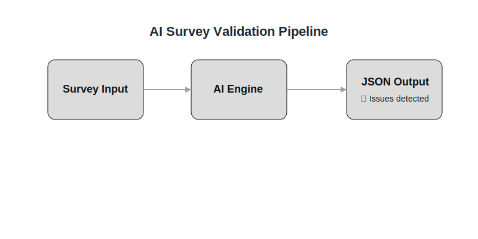

# AI-assisted Survey Validation for Multi-country Data Collection

## Overview

Large-scale surveys used in international and governance contexts often suffer from inconsistencies in question design, unclear definitions, and limited comparability across countries. These issues directly affect data quality, statistical analysis, and policy relevance.

This project explores how Large Language Models (LLMs) can support the systematic review of survey instruments (e.g. XLSForms), identifying design flaws before deployment and improving the reliability and usability of collected data.

## Objective

To develop a lightweight, AI-assisted workflow that evaluates survey questions and flags issues related to:

- Measurement validity  
- Statistical reliability  
- Cross-country comparability  
- Analytical usability  
- Conceptual clarity  

## Approach

The system uses structured prompts to simulate expert-level review of survey questions.

### Input
- Survey questions extracted from XLSForms  
- Metadata and questionnaire structure  

### Process
- Prompt-based evaluation using an LLM  
- Assessment across predefined methodological dimensions:
  - Clarity and precision  
  - Measurement quality  
  - Conceptual validity  
  - Structure  
  - Response design  
  - Comparability  
  - Analytical usability  

### Output
- Structured JSON containing:
  - Identified issues  
  - Severity levels  
  - Explanations  
  - Suggested improvements  

## Repository Structure

ai-survey-validation-mel/

README.md
sample_survey.xlsx

prompts/
   survey_review_prompt.txt

outputs/
   example_output.json

## Key Features

- AI-assisted validation of survey design
- Focus on multi-country comparability and policy relevance
- Structured outputs for integration into data workflows
- Applicable to governance, humanitarian, and international reporting contexts

## Data Protection Considerations
This project does not use real respondent data.
- Only survey structure and question text are processed
- Example outputs are based on synthetic or non-sensitive inputs
- No personal or confidential data is used
This ensures alignment with data protection and responsible data principles in international and governance contexts.

## Use Cases
- Pre-deployment validation of survey instruments
- Quality assurance for multi-country data collection
- Support to indicator standardization and harmonization
- Improving usability of datasets for policy analysis

## Limitations
- LLM outputs depend on prompt quality and may require human validation
- Does not replace expert review, but complements it
- Complex survey logic may require additional contextual input

## Future Improvements
- Batch processing of full XLSForms
- Integration with KoboToolbox / ActivityInfo workflows
- Scoring system for survey quality
- Dashboard for survey diagnostics and comparability risks

## Author
Pedro Martínez Llabata
Data & Evidence Specialist | Survey Design | Information Management
